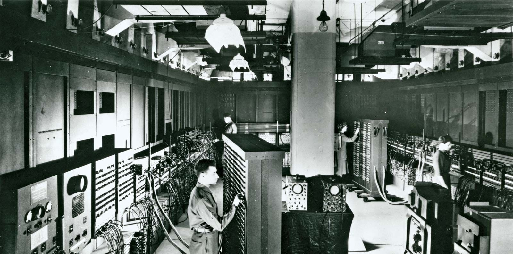
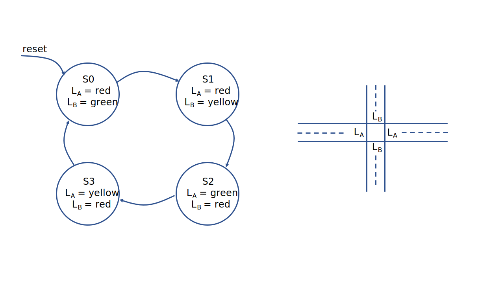
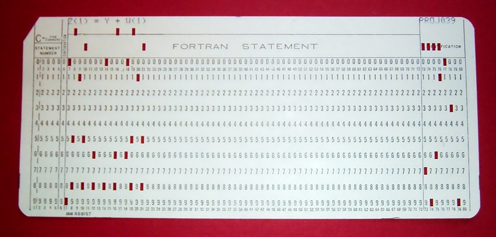

# 从无到有的历程：最简单的计算机

!!! info "世界上第一台通用电子计算机ENIAC"
    <figure markdown>
    { width="600" }
    <figcaption>Irwin Goldstein下士在摩尔电气工程学院设置ENIAC的一个功能表的开关。（来源：[Encyclopædia Britannica](https://www.britannica.com/technology/ENIAC#/media/1/183842/203028)）</figcaption>
    </figure>
    
    ENIAC（Electronic Numerical Integrator and Computer）是世界上第一台通用电子计算机。它于1946年完成并投入使用，由美国宾夕法尼亚大学的约翰·普雷斯珀·艾克特利和约翰·W·莫奇利设计和构建。作为一台庞大的计算机，它占据了一个大型房间的空间，并且使用了大量的真空管和继电器来执行计算任务。

    ENIAC的主要目的是进行科学和工程计算，特别是用于支持原子弹的研究。与现代计算机相比，ENIAC的处理速度较慢，且编程方式相对复杂。它是通过调整电缆和开关来配置和编程的，而不是像现代计算机那样使用高级编程语言。尽管存在一些限制，但它标志着计算机科学和技术的重要里程碑，为后来的计算机发展铺平了道路。

开始之前，我们首先介绍一个非常基本的概念——状态机。简单来说，状态机是这样的一种设备：它保存着当前的某个状态；某一时刻，受到某个外部激励后，状态机保存的状态改变，即状态按照一定的规则迁移。例如，某个十字路口两盏红绿灯随时间的变化，会发生有规律地变化，因此，我们可以将它看作一个状态机。

想象这样的一个情景：一个东西、南北走向的十字路口有两组信号灯$L_A$和$L_B$，同一时刻$L_A$和$L_B$只能有一个为绿灯，表示该方向的车辆可以直走通行。于是，交通信号灯的变化可以通过下面的状态机来表示。初始时，我们设定$L_A$为红灯，$L_B$为绿灯，那么经过一段时间后，$L_B$就会变为黄灯，此时$L_A$仍为红灯；再接下来的变化是$L_A$变为绿灯，$L_B$变为红灯；再然后是$L_A$变为黄灯，$L_B$保持红灯；然后，重新进入$S0$所表示的状态中。



将上面的例子抽象出来，我们就可以描述状态机模型的一些特点。例如，状态机拥有一个状态集合$S=\{ S_0, S_1, ... \}$；此外，状态机模型还规定了状态机的初始状态；在不同的激励下，状态机会迁移到某个特定的状态（次态，next state），这个迁移的过程，而已通过状态转换图的方式直观地呈现出来。

事实上，计算机系统及其在不同层次（数字电路、指令集、程序）的抽象，都可以借助状态机的概念来认识。

### 数字电路

如果说在数字电路抽象层次上，计算机系统是一个状态机，应当说还是比较好理解的。回顾我们在《数字逻辑与计算机设计》课程中的实验，我们构造的数字逻辑电路不外乎时序逻辑电路和组合逻辑电路。时序逻辑电路在时钟信号的激励下，可以更新寄存器的值，而组合逻辑电路为寄存器新的值提供了变化的依据。我们也使用Verilog描述过一个数字电路如何在外界信号输入下依照某种规律进行运转的电路，并在FPGA上呈现。

这个时候我们可以定义的是，状态集合$S=\{ \{ v_{11}, v_{21}, ...\}, \{v_{12}, v_{22}, ...\}, ... \}$，其中$v_{11}, v_{21}, ...$代表了时序逻辑元件当前的值。也就是说，全部时序逻辑元件的值构成的集合构成了状态集合。初始状态则是复位时时序逻辑元件的值。组合逻辑可以依据输入产生输出，从而提供了状态机的激励；最后，状态机在不同的状态间如何转移，也有一套特定的依据。

### 指令集

指令集（instruction set）为计算机执行什么样的操作提供了依据。从状态机的视角来看，它定义了一个模型，其中的状态集合$S=\{ <R, M>\}$，其中$R=\{ \text{PC}, \text{x0}, \text{ra}, ...\}$表示寄存器的值；$M=\{ \text{Mem[0]}, \text{Mem[1]}, ...\}$表示内存中数据的值。指令系统也定义了初始状态，例如可以定义初始时$\text{PC}=0$，即从内存中地址为0的地方开始执行程序。通过PC指向的内存地址读取出的指令，就是电路的激励；而指令的实际语义（sematics），就是状态转移的规则。

通过数字电路实现指令集所描述的状态机，我们就能执行指令，进而运行程序了。

### C语言程序

现在我们到了比较高的抽象层次，C语言程序。C语言程序所构成的状态机模型的状态集合$S=\{ <V, \text{PC}> \}$，其中$V$代表了程序中全部变量的值，$\text{PC}$是这个程序当前执行到的语句。激励是$\text{PC}$所指向的语句，状态转移规则是语句的语义。在这里，C语言程序的初始状态$S_0=<V_0, \text{PC}_0>$。$V_0$是好理解的，我们在编写C语言程序时可能会预先为变量设置初始值，$\text{PC}_0$则是C语言程序所执行的第一条语句。至于C语言程序从哪里开始执行，C99手册提供了下面的说法。

!!! note "5.1.2 Execution environments"
    Two execution environments are defined: *freestanding* and *hosted*. In both cases, *program startup* occurs when a designated C function is called by the execution environment. All objects with static storage duration shall be *initialized* (set to their initial values) before program startup. The manner and timing of such initialization are otherwise unspecified. Program termination returns control to the execution environment.

也就是说，运行环境负责去调用某个专门的C语言函数，从而程序得以运行。

!!! note "5.1.2.1 Freestanding environment"

    In a freestanding environment (in which C program execution may take place without any benefit of an operating system), the name and type of the function called at program startup are implementation-defined. Any library facilities available to a freestanding program, other than the minimal set required by clause 4, are implementation-defined.
    
    The effect of program termination in a freestanding environment is implementation-defined.

在freestanding的环境下，这个C语言函数是由实现具体定义的。

!!! note "5.1.2.2 Hosted environment"

    5.1.2.2.1 Program startup
    
    The function called at program startup is named main. The implementation declares no prototype for this function.&#x20;

在hosted的环境下，这个C语言函数被固定为main()。这也就是为什么我们一开始写最简单的C语言程序时，我们总是从main()开始学习的。

顺便，我们解决了一个重要问题，什么是汇编器？汇编器（compiler）的工作，是将C语言程序所描述的状态机翻译为指令集系统描述的状态机。由于汇编代码就是由C语言描述的状态机翻译得来的结果，因此汇编语言的学习就被简化为查阅手册，然后像写C语言程序那样描述状态机。

### 自制freestanding运行时环境

我们接下来就将自制一个最简单的运行时环境，来为我们写的其他的程序的执行提供必要的支持。

采用RISC-V指令集，假设我们的程序从内存地址为0的地方开始执行，我们计划支持RISC-V指令集的一个子集，其中包含

-   存储器访问指令load doubleword (ld)和store doubleword (sd)；
-   算术逻辑运算指令add, addi, sub, and, or, andi；
-   条件分支指令branch if equal (beq)；
-   跳转并链接指令：jump and link (jal)和jump and link register (jalr)；
-   ebreak指令：当寄存器a0=0时，输出寄存器a1的低8位字符，当寄存器a1=1时，结束运行。

现在我们编写一段能够输出字符Hello的程序，当然，我们要始终记住的是，我们没有\<stdio.h>这样的头文件，并且我们编写的代码只能包含上面所说的若干指令！

```c
static void ebreak(long arg0, long arg1) {
  asm volatile("addi a0, x0, %0;"
               "addi a1, x0, %1;"
               "ebreak"::"i"(arg0), "i"(arg1));
}
static void putch(char ch) { ebreak(0, ch); }
static void halt(int code) { ebreak(1, code); while (1); }

void _start() {
  putch('H');
  putch('e');
  putch('l');
  putch('l');
  putch('o');
  halt(0);
}
```

这段代码通过riscv-gcc编译，然后使用llvm-objdump反汇编，我们确实可以看到这个程序只包含了我们要实现的子集中的指令。

=== "编译命令"

    ```bash
    riscvgcc -march=rv64g -ffreestanding -nostdlib \ 
    -static -Wl,-Ttext=0 -O2 -o hello hello_freestanding.c
    llvm-objdump -M no-aliases -d hello
    ```

```
hello:  file format elf64-littleriscv

Disassembly of section .text:

0000000000000000 <_start>:
       0: 13 05 00 00   addi    a0, zero, 0
       4: 93 05 80 04   addi    a1, zero, 72
       8: 73 00 10 00   ebreak
       c: 13 05 00 00   addi    a0, zero, 0
      10: 93 05 50 06   addi    a1, zero, 101
      14: 73 00 10 00   ebreak
      18: 13 05 00 00   addi    a0, zero, 0
      1c: 93 05 c0 06   addi    a1, zero, 108
      20: 73 00 10 00   ebreak
      24: 13 05 00 00   addi    a0, zero, 0
      28: 93 05 c0 06   addi    a1, zero, 108
      2c: 73 00 10 00   ebreak
      30: 13 05 00 00   addi    a0, zero, 0
      34: 93 05 f0 06   addi    a1, zero, 111
      38: 73 00 10 00   ebreak
      3c: 13 05 10 00   addi    a0, zero, 1
      40: 93 05 00 00   addi    a1, zero, 0
      44: 73 00 10 00   ebreak
      48: 6f 00 00 00   jal     zero, 0x48 <_start+0x48>
```

好了，现在我们希望把这段代码能够运行起来，应该怎么做呢？我们要为它的运行提供一个环境，实现这个环境，本质上也就是使用C语言实现一个指令集状态机。

#### 使用C语言变量模拟寄存器与内存

要做到这一点还是相对容易的。`<stdint.h>`为我们定义了一系列数据类型，能够帮助我们在不同的机器上使用相同字节大小的变量。下面的代码展现了如何模拟一个RISC-V存储器系统，其中包含了32个64位的寄存器、一个程序计数器寄存器PC和一个64字节的内存，这个内存是按照字节进行寻址的。

```c
#include <stdint.h>
uint64_t reg[32];
uint64_t pc;
uint8_t mem[64];

```

#### 使用C语言模拟指令的语义

在CPU中，在一个指令执行的周期内，一般会有若干个过程。首先是取指，即从PC所指示的内存地址中读取出要执行的指令；接下来是译码，也就是按照指令集手册解析要进行操作的操作数和操作类型；然后是执行阶段，按照译码阶段给出的操作类型对操作数进行操作；之后还有访问存储器（寄存器和内存）的步骤，从内存中读出数据，或将数据写回内存和寄存器。最后，更新PC的值，指向接下来要执行的指令。

从初始状态出发，状态机不断地执行指令，我们也可以控制什么时候停止执行。

```c
#include <stdbool.h>
bool halt = false;
while(!halt){
    cycle();
}
```

#### 初始状态

在RISC-V手册Volume II中，提到了初始状态是什么样的，更具体的内容可以参阅手册第3.4节（注意：手册中的hart一词指的是hardware thread，即硬件线程）。这里我们关注下面这句话。

> The `pc` is set to an implementation-defined reset vector.

复位时，PC的值被设置为什么，是通过我们的实现来决定的。也就是说，我们在实现这样一个状态机的时候，可以约定PC具体的值。

#### 一种简单实现的代码框架

下面的代码运作的流程基本上是从文件读入程序，然后执行。file\_open()函数实现了对文件的读取；cycle()函数内包含了我们刚刚提到的取指、译码、执行、访存和写回等阶段。这是一个最为简单的实现，但是它真真切切能够运行我们刚刚编写的程序！

```c
#include <stdint.h>
#include <stdbool.h>
#include <stdlib.h>
uint64_t reg[32];
uint64_t pc;
uint8_t mem[64];
void file_open(char* filename);
void cycle();
int main(int argc, char* argv[]){
    char* filename = argv[1];
    file_open(filename);
    pc = 0;
    reg[0] = 0;
    bool halt = false;
    while(!halt){
        cycle();
    }
    return 0;
}
```

至于我们如何生成我们想运行的程序，可以借助llvm-objcopy来完成。

=== "反汇编命令"

    ```bash
    llvm-objcopy -j .text -O binary hello hello.bin
    ```

#### 控制程序的结束

C语言程序是如何结束的？在以往的实践中我们也没有思考过这个问题，毕竟只需要在写完主体代码后顺手加上一个return 0就可以了。当然，C99手册事无巨细地定义好了这些看似不重要实际是灵魂拷问的细节。

在上一个小节引述的C99在5.1.2.1节关于freestanding运行环境中的内容，手册已经定义清楚了，程序结束运行也是通过我们具体的实现来决定的。例如，我们可以人为控制我们的状态机在向某个内存地址写入某个特定的值的时候结束运行。

### 最简单的操作系统

对于初涉计算机系统的人来说，一个他们往往不曾想到的事情是，并不需要操作系统的支持，我们也能在裸机（bare metal）上运行C语言程序（事实是，我们刚刚就编写了一个不需要链接到标准库、可以在裸机上直接运行的C语言程序！）。那么我们不禁要问的是，在操作系统上运行程序时，操作系统提供了什么样的功能？如果失去了这些功能，我们的程序还想继续正常地运行，我们需要采取什么样的额外措施？

上面的问题如果放到20世纪40年代，一个还没有操作系统的时代，一定是会被人们嘲笑的。一方面，“计算”本身还是相当昂贵的资源，许多用户都还等待着使用计算机为若干更为重要的工作服务，怎么会有人把宝贵的CPU时间浪费在一个不能计算的程序上呢？另一方面，操作系统好像也不能提供什么有用的功能，失去了操作系统，计算机管理员依然可以把纸带按照顺序送入机器，然后分时段为客户服务，客户的程序也能够正常运行。

进入20世纪50年代，晶体管的出现提高了计算机的可靠性。计算机系统拥有着更小和更快的晶体管和更大的存储器（一位名叫王安的人发明了磁芯存储器），同时各种低速外设也被发明出来。在这样的情况下，I/O的速度开始逐渐落后于处理器的速度，也因此，中断机制被引入到了计算机系统中。



同时，高级语言诞生了。像上面这张图片所显示的那样（Fortran是一个古老的语言，但至今仍然有许多科学计算的应用在使用它），人们可以将卡片插入到计算机中，然后计算机就可以执行高级语言书写的程序。那么，有没有一种可能，我们能够将所有的卡片一次性插入到计算机中，然后让计算机来决定什么时候运行某一张卡片上的程序？

终于，操作系统的概念开始形成。操作系统为任务之间的切换提供了支持，并且开始诞生出一些API，这些API为语言程序提供了通用的接口，例如数学库函数，便于让程序员更容易进行编程。

时间来到1960年代，硬件开始飞速发展。集成电路诞生，整个计算机系体结构的发展开始朝着摩尔定律指向的光明前程不断努力，处理器的能力以惊人的速率增长；总线也出现了，内存变得更大，我们可以同时载入多个程序，而不需要在卡片见来回切换。与此同时，更多的高级语言和编译器被发明出来（COBOL (1960), APL (1962), BASIC (1965)）。自然地，操作系统将共享资源以API的形式管理起来，达到不同任务之间的相对隔离；一个进程在执行I/O时，可以将CPU让给另一个进程。

进入1970年以后，得益于摩尔定律，个人电脑也开始走进人们的生活，大体上与我们今天能使用的计算机和计算机软件已经没有太大的差别。在这样的形势下，分时系统走向成熟和UNIX完善为现代操作系统勾画了蓝图。

在今天，硬件空前发展，我们拥有了更复杂的处理器和内存。非对称多处理器和非对称内存访问的系统上，人们还发展了多种硬件机制；计算机拥有了空前丰富的外设和存储空间；同时，计算机系统在应用场景上也变得更加复杂，从超级计算机到IoT设备，每一个地方都能看见微处理器的身影。

所以...操作系统，就是操作系统的历史。如果让我们采用现代的视角来审视这个问题，那么在操作系统之上的应用程序看来，操作系统就是一系列对象和API的集合；从硬件的视角来看，为了实现这些API，操作系统也仅仅只是一个C语言程序，计算机上电后，这个程序就开始运行；在启动了第一个用户程序之后，它就变为一个中断控制程序，一切需要它提供服务时，它都会被应用程序发出的中断所唤醒。

和大多数学科所描绘的事物一样，抛开纷繁复杂的外壳，操作系统的本质就是这么简单。

现在，我们要记住，操作系统也不过就只是一个运行在机器上的程序，我们最开始用汇编语言初始化好一些寄存器的值（它们往往是一些重要的寄存器，例如栈指针寄存器），然后调用我们的函数，在编译时不引入任何的标准库文件，我们的操作系统就能够正确地运行起来。

我们在QEMU上可以实现我们刚刚描述的工作。QEMU是一个高性能的全系统模拟器，近年来甚至有开发者将其移植到了iOS平台，使得像搭载了M1芯片的iPad Pro也可以运行虚拟机系统。下面这段汇编代码就为我们的操作系统运行提供了最基本的环境。

```
    .equ STACKSIZE, 1024
    .global _start
    .text
_start: # 上电后由bootloader跳转到0x80000000
    # 建立栈
    la sp, stacks + STACK_SIZE # 将栈设置为stacks的地址加上栈的大小 
    j kernel_entry

stacks:
    .skip STACK_SIZE* MAX_CPU_NUMBER # 用0来填充所有的栈上的空间
    .end
```

然后另起一个C语言文件，我们就能以我们最熟悉的方式书写我们的操作系统内核代码了。当然，现在我们什么功能也没有实现，我们只是让处理器进入一个循环。

```c
void kernel_entry(){
    while(1){;}
}
```

### 软硬件的联系

程序是存放在计算机存储器中的文本（依照计算机的组成，更准确的说，是存放在存储器中的0-1串），指令集更显得抽象一些，呈现给我们的似乎只有一个指令集文档；而我们知道，数字电路是一个物理实体。这三个不同的抽象层次，是如何得以相互联系起来的？

事实上，根据指令集手册的描述，我们就可以通过硬件描述语言设计数字电路，得到处理器的版图，然后交付给晶圆厂。晶圆厂依照我们的版图在某个特定的特征尺寸上蚀刻我们的版图，然后我们就能得到一块集成电路，这就是我们的处理器实体。对于程序员来说，编写高级语言代码，然后进行编译，就将代码转换为指令集状态机，然后这些指令就作为激励，控制处理器芯片的状态转移。于是三个抽象层次的状态机在指令集层次创造联系，这也是我们说为什么指令集是软硬件接口的原因。

这一点我们在《计算机系统漫游》中会进一步详细地介绍。
