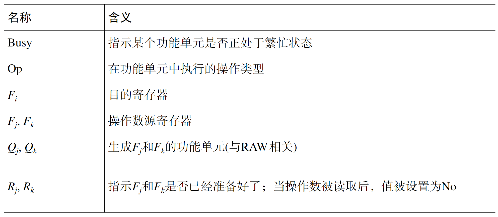
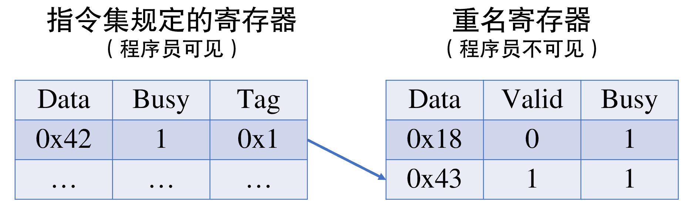
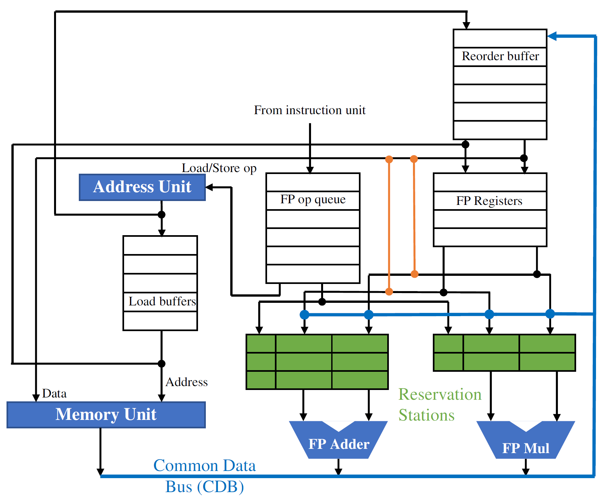
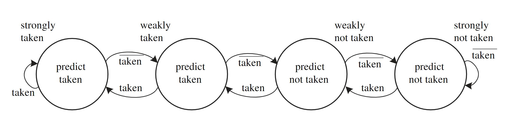
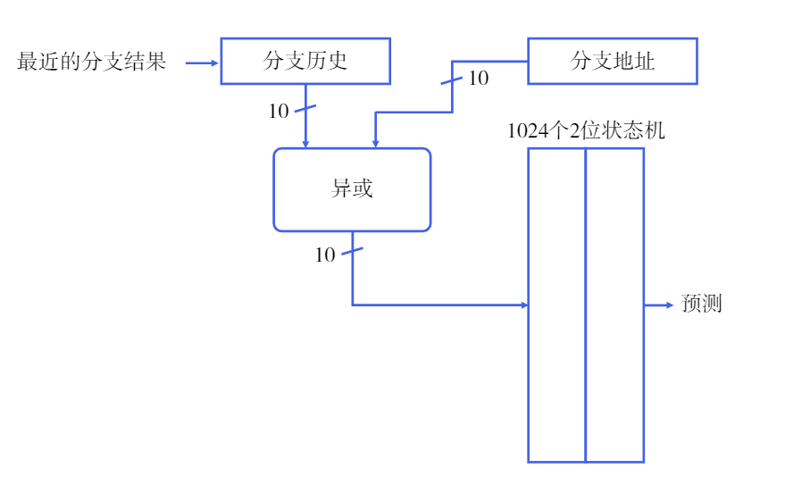
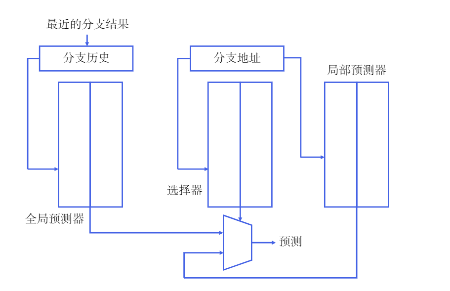
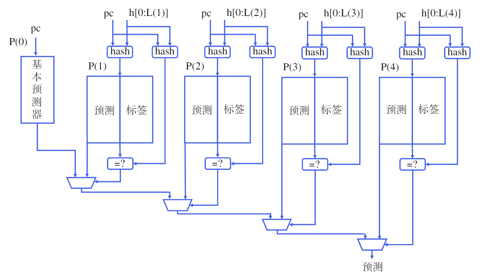

# 乱序执行的魔法：数据依赖与指令级并行

!!! info "革命性的高性能超级计算机CDC 6600"
    <figure markdown>
    { width="500" }
    <figcaption>CDC6600被许多人认为是世界上第一个成功的超级计算机，每秒的浮点运算次数达到了一百万次。（来源：[Courtesy of Control Data Corporation](https://www.computerhistory.org/revolution/supercomputers/10/33/57)）</figcaption>
    </figure>

    CDC 6600的出现标志着超级计算机的发展进入了一个新的阶段，它在科学、工程和军事等领域发挥了重要作用，并对后来的计算机设计产生了深远影响。作为是当时世界上最快的计算机，其浮点运算峰值性能达到每秒一百万次。它具有10个处理器，并且由于采用了高度并行的设计，每个处理器都能同时执行多个指令，从而实现了出色的计算性能。

现在的市场上，人们几乎很难找到面向消费者级别的，单周期或多周期的处理器了。在一些微控制器中，也用上了像Cortex-M0这样的三级流水线的处理器。一般而言，基本流水线能让我们获得的每周期指令数（instructions per cycle, IPC）不会比1大。这里我们主要考虑的因素是流水线中存在的数据依赖关系可能造成流水线的阻塞。

要想解决这个问题，历史上主要有两条思路，一方面是我们可以增加流水线的数量，例如，我们使两条流水线共同工作；另一方面，我们试图继续挖掘方法，减小指令之间的相关性带来的影响。

### 记分牌算法

基于我们朴素的认识，顺序执行的流水线很容易发生阻塞的问题。例如，load指令可能在访存阶段会遇到缓存不命中（cache miss），那么，流水线必须停下来，等待若干周期，等到正确获取到内存中的数据后再继续执行。而由于处理器和存储器发展非常不平衡，这一阶段可能会浪费掉几十甚至几百个时钟周期。假如load指令之后的若干指令都与load指令不存在数据依赖关系，理所应当地就可以“绕过”load指令接着执行。

在简单五级流水线中，我们假定每一条指令的执行都一定会经历取指、译码、执行、访存、写回的阶段。事实上，某些指令确实不需要经历上述五个阶段当中的某些阶段，因此，我们需要想办法为数据的流动多提供一些通路，这样，当某个部件被使用，而接下来指令的执行并不需要这个部件的时候，就不用强迫流水线暂停下来。

CDC公司于20世纪60年代建造的CDC 6600（本章题图）上首次应用了记分牌（scoreboard）算法。在CDC 6600上，记分牌算法将指令执行的控制分为四个阶段：发射、取数、执行、写回。发射阶段，对指令进行译码，并且检查是否存在写后写的数据依赖关系；取数阶段，等到将要执行的指令不存在数据依赖关系之后，读出操作数，这一阶段还解决了写后读的依赖关系；执行阶段对操作数进行操作；写回阶段，记分牌检查是否存在读后写依赖，如果存在，就暂停执行，不存在则向寄存器中写入数据。

#### 记分牌的结构

记分牌实际上是一个信息存储单元，记录了这三部分信息：指令状态、功能单元状态、寄存器结果状态。其中，指令状态主要指某条指令的执行处于哪个阶段当中，寄存器结果状态则指示了某个寄存器即将被哪个功能单元写入。功能单元状态记录的数据较为复杂，主要是关于操作数和某个功能单元是否处于繁忙状态。



在记分牌算法中，一条指令能否被发射，取决于功能部件是否空闲和指令要写入的寄存器是否正要被其他指令写入，这就需要检查寄存器结果状态，以解决写后写冒险。

取数阶段，如果源寄存器将要被其他指令所改写，那么当前指令就必须等待。在前序指令改写完寄存器后，才能取得正确的操作数。

对于浮点运算等需要多周期才能完成的运算操作，在第一周期结束时需要将$R_j$和$R_k$设置为No，这样才不会影响其他指令取数。

写回寄存器时，需要检查目的寄存器是否会被作为操作数源寄存器被其他指令所读取，实际上就是检查标记为Yes的$R_j$和$R_k$寄存器中是否有寄存器是当前指令的目的寄存器。如果有，那么说明有指令需要读取寄存器中的旧值，这个时候写回操作需要被暂停，等待读取结束后再写入，这样是为了解决读后写冒险。

#### 记分牌的优缺点

记分牌算法实际上实现了指令的顺序发射和乱序执行。既然指令还是顺序发射的，那么执行就依然会受到读后写和写后写冒险产生的数据冒险。由于记分牌规定每一条配置路线只能同时有一条指令处于执行过程中，因此后续相同类型的指令也就必须等待。最后，记分牌算法在写回时不是按照程序编写的顺序进行的，对于程序员来说，会造成程序调试上的困难。

### Tomasulo算法

上面提到的记分牌算法中，如果遇到读后写（WAR）和写后写（WAW）这两种数据依赖关系，指令的执行就会受到阻塞。Tomasulo算法实际上是通过寄存器重名，解决了WAR和WAW这两类“伪数据依赖”。IBM System/360系列机器是最早使用这一架构的。

#### 数据依赖

我们来逐一研究WAW、WAR和RAW这三种数据依赖的情形。

```纯文本
add x7, x1, x4
add x5, x7, x6
add x7, x1, x0

```

在上面这段汇编代码中，第一条指令和第三条指令都写入了x7寄存器，但实际上，第一条指令产生的x7作为源操作数被第二条指令所使用，然后，第三条指令又将某个运算产生的结果写入了x7寄存器。在这个过程中，x7寄存器仅仅是作为目的寄存器被两次写入，作为源操作数寄存器被一次读取而已。将第三条指令的目的寄存器替换为某个未被使用的寄存器，也不影响指令的执行和最终的结果。

```纯文本
add x7, x1, x4
add x1, x6, x3

```

在上面这段汇编代码中，采用类似的思想，我们可以明白，第二条指令中的目的寄存器x1也完全可以替换为某个未被使用的寄存器，而不会导致结果的错误。

上面两种数据依赖关系都是典型的“假依赖”；使用附加的寄存器资源，就能够解决问题，并且得到我们预期的结果。在实际生活中这种寄存器重名的思路也是非常常见的：某些学校会为入学的学生根据姓名拼音和入学年份给定校园网账号，如果有两个人拼音相同，则会使用类似zhangsan21a, zhangsan21b这样的方式加以区分。

而RAW则是真正的数据依赖了。当我们讨论数据依赖，实际上是在说发生冒险的指令之间存在数据流动。如果我们的目标是尽快得到正确的结果，那么我们的结果存放在什么地方其实并不重要（只需要让程序员看上去是在预期的地方即可），因此WAW和WAR可以由寄存器重名解决。在RAW的情况下，某条指令产生的结果是真的需要被另一套指令所使用，因此我们说RAW是不可避免的数据依赖。

#### 寄存器重命名

附加的寄存器通常是ISA规定以外的一组物理资源。如下图所示，如果某个寄存器正要被改写或者被读取，那么置Busy位为1，并将数据写入到Tag指示的附加寄存器中。这样，新的数据可以立刻走完写回的过程，而程序顺序中排列靠前的指令可以读取到寄存器旧的值。



还有一种思路，是为处理器提供超过指令集规定的寄存器个数，但是并不显示地区分哪个是指令集规定的寄存器，哪个是重名寄存器。程序员对寄存器的可见情况，取决于程序运行的状态——这些信息我们需要储存起来，依照这些信息，处理器可以像程序员展现某些特定的寄存器。

#### 硬件结构


#### 算法优点

Tomasulo算法消除了三类数据冒险，可以实现指令的乱序执行。与记分牌相比，Tomasulo算法引入的保留站能够在每条通路下缓存若干指令，从而减少了结构冒险阻塞流水线带来的损失。

Tomasulo算法中，引入了寄存器重名的思路，寄存器只保存最近写入的值。记分牌算法无法实现寄存器重命名，因此在遇到写后写冒险时只能阻塞流水线。

记分牌在取数时需要时刻关注寄存器堆，必须等到寄存器堆内的数据准备好，才能取出来。因此，在读后写冒险中，程序中的后续指令不能立即将结果写回寄存器，否则可能导致前序指令取到错误的数据。Tomasulo算法在指令发射时就将寄存器中的数据拷贝到保留站中，之后寄存器中的值不论再怎么变化也不会影响保留站中的数据。

#### 算法缺点

在Tomasulo算法中，每一个功能单元都有一个保留站。如果一周期内有多条指令被准备好，那么功能单元也只能执行一条指令。一般而言，可以将保留站设计为队列，总是选择最先发射的指令执行。

在上面的架构图中，我们只有1组CDB，这意味着如果在某一周期结束时有多条指令被执行完毕，我们也只能写回1组数据，其他组必须进行等待。或许增加CDB总线可以解决这个问题，但是这会带来更大的硬件消耗。

为了支持指令的多发射，还需要对寄存器堆做一些额外的改造，例如增加读写端口等。在多发射的情况下还需要保证它们按照顺序发射一样的顺序更新保留站和寄存器结果状态表。对于存储指令，也需要做额外的控制，消除存储指令间的数据冲突。

Tomasulo算法无法实现精确的中断。如果指令和指令之间出现了中断或异常，我们希望处理器要将中断/异常之前的指令全部执行完成，并且中断/异常之后的指令都不会被执行。精确中断是程序正确执行和调试必不可少的条件，但Tomusulo对寄存器的写入也是乱序的，因此它不支持精确中断。对于分支指令来说，如果分支预测错误，那么记分牌和Tomasulo算法都很难消除已经执行完毕但本不应该执行的指令带来的影响。为了支持分支指令和精确中断，就必须保证指令的按序提交。

总体而言，现代桌面级处理器一般都是采用乱序执行+按序提交的方法进行工作的。

### 重排序缓存ROB

ROB的核心思想在于按照指令在程序中的顺序进行提交。一条指令在执行完毕后并不会马上对寄存器的状态做出改变，而是先在缓冲区中等待，等到在程序中所有它前面的指令已经执行完毕并且提交以后，再将结果写回寄存器堆。

一般来说，可以将ROB设计为一个队列，指令在发射的时候进入队列，在提交的时候出队。

#### 改造后的Tomasulo硬件结构



与最初的Tomasulo相比，现在主要增加了Reorder Buffer（ROB）；CDB总线不再直接向寄存器堆写入数据；指令发射时可以从ROB中读出数据。

每条指令发射时，ROB会为其分配一个编号，实际上是起到了寄存器重命名的作用。Busy位指示这一行是否存有指令；State位保存指令当前的运行情况，可以通过State来判断指令是否可以提交；Destination指示了指令的目的寄存器；value保存的是指令的结果，当可以提交时，value将被写入指令集规定的寄存器。此外，在一条指令执行完成但还不能提交时，后续指令可以从value中读出值，实现数据旁路的功能。

#### 要点概述

增加ROB后，指令能否发射主要取决于保留站和ROB是否空闲。如果都空闲，那么指令就可以发射。发射后，保留站和ROB都会增加1个占用，并且目的寄存器对应的寄存器结果状态表会被标记为ROB的编号——这就实现了寄存器的重命名。

如果指令不能正确从寄存器堆取得数据，就会通过寄存器结果状态表查询。如果操作数由正在执行的指令给出，那么指令需要监听CDB，一旦数据在CDB上后，就从CDB转发到保留站中。如果操作数正在ROB中，还没有写回寄存器堆，那么就从ROB中读取。

指令开始执行后，实际上就可以清除保留站中这条指令相关的信息了。执行完成以后，结果先通过CDB被写到ROB，而暂时不更新寄存器堆；等到这条指令之前所有的指令都已经提交之后，这条指令就可以提交，寄存器将被更新，ROB对应的Busy位将被置为无效。

#### 对分支预测的支持

ROB结构实现了指令的按序提交，因此可以在指令提交时检测分支结果。如果预测失败，就清除ROB中的全部指令，同时在下一周期使用分支指定的地址取指。对精确中断的支持原理也是类似的。

### 寄存器重命名

我们之前已经多次提到过，只有RAW才是真数据依赖关系。那么，我们自然可以想到，通过增加一组寄存器，使其能够保存执行单元得到的结果，在合适的时候再写回逻辑寄存器堆，不就能够解决WAW和WAR当中寄存器数量不够用的问题了吗？

事实确实如此。在前文介绍过的ROB中我们事实上已经开始使用隐式寄存器重命名技术。ROB中，value一项保存了指令执行的结果，这实际上就承担了额外的寄存器的作用。在这里我们继续介绍显式寄存器重命名的方法。在显式寄存器重命名的方案中，我们首先需要准备比逻辑寄存器数量多的物理寄存器，这些物理寄存器中既包含已提交的，也包含未提交的。

我们使用一张对应表来指示程序员可见的逻辑寄存器和实际的物理寄存器的映射关系。提交一个物理寄存器，就是修改这张映射表，使得在访问某个寄存器时，指向修改后的物理寄存器。

### 分支预测

如果希望增大指令级并行的力度，那么分支预测就成为了非常必要的部件。当流水线层数增加时，分支预测错误就要求清洗流水线中正在执行的取指错误的指令，然后再从正确的位置开始取指。如果在一个超标量流水线处理器中，则可能需要冲刷更多的功能部件。增加分支预测的准确度，在提升计算机的性能方面是十分重要的。在《数字逻辑与计算机设计》中，我们曾经简单地了解过分支预测的基本原则。我们最初实现了下面这样的最简单的2位分支预测器。



这个预测器的思想非常简单，假定我们设置状态机的初始状态为强跳转（11），在一次预测失败后变为弱跳转（10），再次预测失败后将变为弱不跳转（01），如果这次预测成功，则将变为强不跳转（00）。对于规律性很强的一些语句（例如确定的分支语句和循环语句），这个简单的预测器已经能够达到很好的效果，但是，随着流水线不断变深，分支预测失败的代价越来越大，因为硬件必须刷新掉低层级流水线阶段的数据，然后从正确的位置重新取指。

能不能尽快决定是否跳转？答案是可以的。对流水线进行适当的划分，并控制好数据间的依赖关系，的确能够让我们在译码阶段就能判断某条指令是否会发生跳转，从而在分支预测错误时最多只需要刷新取指和译码阶段的流水线寄存器。然而这样对于译码阶段来说，时序压力可能会增大，从而处理器的主频可能受到影响。

在今天，几乎所有的桌面处理器都采用了精妙的分支预测方法，来尽可能准地推测某条指令的跳转情况。

#### 关联预测器

尽管没有确切的数学方法证明某条分支的跳转情况不仅与该分支历史跳转情况相关，还与其他分支的行为有关系，但是实践中发现，对于这些信息的巧妙运用，的确能够提高分支预测的准确率。假设有下面这样的代码：

```c
if (a == 1) b = 1;
if (b == 1) a = 0;
if (a == b) {...}
```

我们将上述分支标记为b0、b1和b2，显然b2跳转与否与b0和b1的行为相关。如果b0和b1都没有发生跳转（顺序执行），那么这意味着在进入b3的条件判断时，变量a的值一定为0，变量b的值一定为1，从而b3一定会发生跳转。如果我们只考虑b3本身的行为，那么上面所示的最简单的2位分支预测器就不能提供正确的答案。

现在我们可以考虑把其他分支的行为也纳入我们的考虑中。我们可以构建若干个表项，并将最近$m$个分支的跳转情况与分支地址的低地址位拼接，通过某种哈希函数在表项中检索。每个表项实际上也是一个类似上面提到的简单2位分支预测器。一般情况下，我们可以构造一个$(m,n)$预测器，其含义是利用最近$m$个分支的行为进行检索，每个检索项都是一个简单$n$位分支预测器。我们把这种预测器称为关联预测器（correlating predictor）或两级预测器（two-level predictor）。

对于硬件设计人员来说，这样做并不需要花费太多的精力，但是预测准确率会有很大的提升。

##### Gshare预测器

Gshare分支预测器非常容易实现，并且具有很好的实用价值。在Gshare中，分支地址的低10位与全局最近10次分支历史的移位寄存器值做异或操作，然后作为索引去从1024个2位预测器的状态机中查找是否跳转的结论。



在Gshare中，对局部分支信息的利用主要体现在2位状态机的转台变化上。这种将局部分支历史和全局分支历史相结合使用的预测器被称作融合预测器（alloyed predictor）或混合预测器（hybrid predictor）。但是，由于全局分支历史结果不断在变化，很难出现分支地址与最近分支结果进行异或操作后一定命中某个状态机。有些情况下，可能显式地确切展现出局部分支历史会更有效。

#### 竞争预测器

正如名称所表示的那样，竞争预测器（tournament predictor，直译为锦标赛分支预测器）的预测结果来自多个预测器的竞争，它通常会显式地标明对于某一条分支地址而言，一定对应某个状态机。在现在的设计中，每一条分支地址被分配了一个选择器，选择器的值表示是选择来自全局预测器的结果，还是选择来自局部预测器的结果。其余部分可以简单理解为是一个全局预测器加上一个局部预测器。与2位状态机预测器采取的策略一样，只有在连续两次预测失败时，选择器的选择才会发生变化。



在这个分支预测器中，如果预测错误，不仅需要同时更新全局预测器和局部预测器的状态机，还需要更新选择器的状态机。它的优势在于它能够为特定分支选择正确的预测器，当分支情况很复杂而出现多次时，这个预测器的效果将会很好。

#### 带标签的混合预测器

2006年，André Seznec和Pierre Michaud提出了TAGE分支预测器，使用一系列不同长度的全局历史帮助索引来进行预测。TAGE及其变种之后在Championship Branch Prediction比赛中多次拿下冠军。在论文中，TAGE的结构如下图所示。

与Gshare类似，TAGE将最近的一些分支记录保存到移位寄存器中。在P(i)中，PC与长度为L(i)的分支历史记录进行哈希操作（比如异或），然后与标签作比较，只有当标签与散列的结果一致时，才会使用P(i)中的预测。事实上，标签可以很短，而不需要使其位数和L(i)一致。



如果P(n)到P(1)都没有成功匹配，那么P(0)将成为预测结果的来源，它是一个简单2位状态机预测器。TAGE还有许多实现上的具体细节，例如如何定期将所有项中的重复字段进行复位以清除过早的预测等。

从现实世界来看，现代CPU使用了多种技术来提高分支预测准确度。桌面级产品大多都使用了TAGE预测器。近年来，AMD Ryzen也将简单的神经网络用于分支预测（受限于硬件实现而不能承载一个大型网络），随着单个程序的运行，分支预测准确率会不断提高。

### 理解现代处理器

“处理器也是一个动态编译器。”正如我们在指令系统一章所提到的那样，处理器将汇编代码用电路编译成更小的位操作（μop），在任意时刻，处理器都维护一个μop的池子，每一周期在不违反编译正确性的前提下执行尽可能多的μop（乱序执行、按序提交），在这个过程中保持计算机系统可观测行为（状态机的状态）与程序员代码的一致性；剩下的就是阿姆达尔定律：哪里慢了就加速哪里。