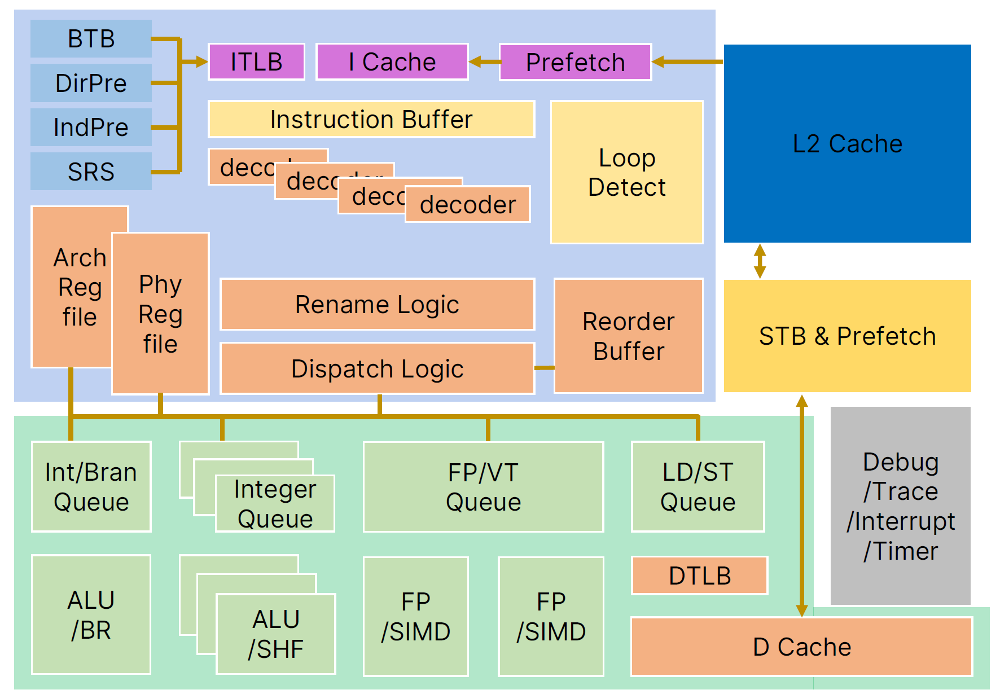
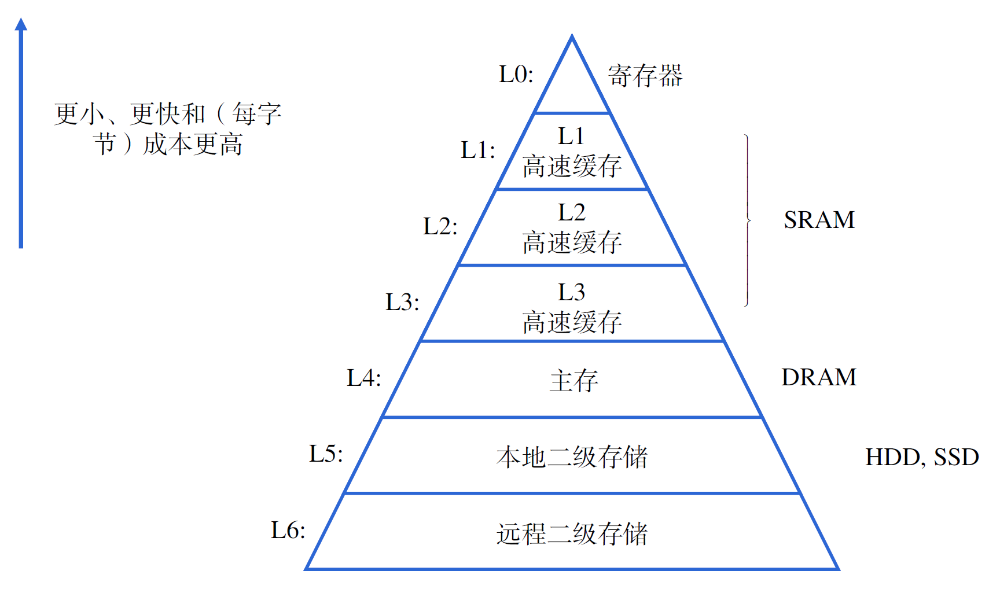
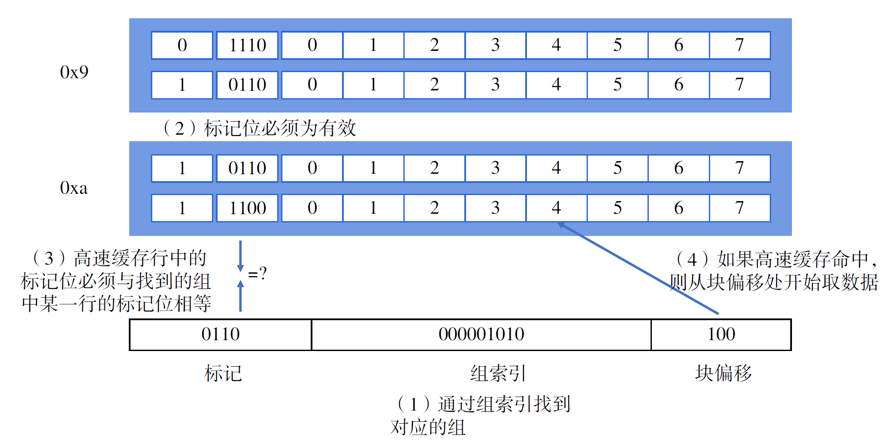
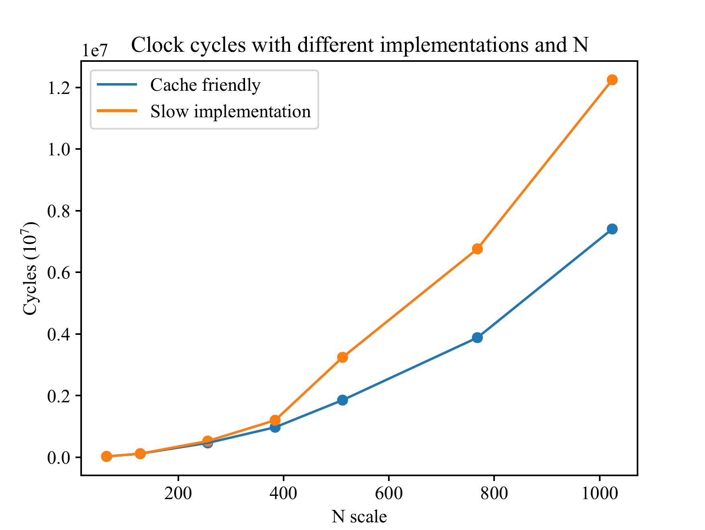
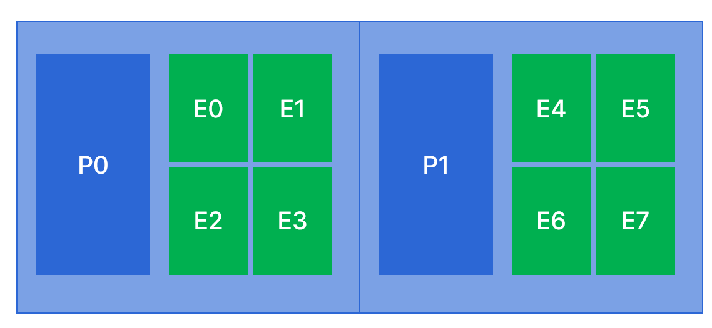

# 局部与整体协调：优化程序性能

!!! info "John Hennessy and David Patterson"
    <figure markdown>
    { width="600" }
    <figcaption>John Hennessy and David Patterson circa 1991, upon publication of their groundbreaking book on computer architecture.（来源：[Berkeley(Shane Harvey photo)](https://news.berkeley.edu/2018/03/21/david-patterson-pioneer-of-modern-computer-architecture-receives-turing-award/)）</figcaption>
    </figure>

    John Hennessy和David Patterson共同获得了2017年的图灵奖，以表彰他们在计算机体系结构设计方面的杰出贡献，在计算机体系结构的设计和评估中开创了一种系统化、定量化的方法，并对微处理器行业产生了持久的影响。

当我们造出一台新机器，我们当然想知道，我们的机器有“多好”，也就是我们的机器实际使用起来的性能怎么样。

上世纪80年代以后，特别是90年代以来，计算机发展的一个重要引导性因素，就是对计算机的评测定量化了。也就是说，为了得到能够让大多数人都认可的结果，说明某一个计算机在某种条件下具体的性能指标是多少，对计算机的评测变得定量化起来。

在我们的单核处理器上，我们考虑这样的标准：

$$
\text{CPU时间}=\frac{运行时间}{程序}=\frac{指令数}{程序}\times \frac{时钟周期数}{指令数}\times \frac{运行时间}{时钟周期数}
$$

我们来解释这个事情，直观上，我们给定1个程序，那么从这个程序开始执行到执行完成所耗费的，我们在现实世界中可以直接通过测量得到的时间就被认为是运行时间。根据处理器设计的原理，这个计算方式又可以被展开为三个指标相乘。

指令数和程序的比值表现了对于相同的高级语言（例如C）程序，依照指令集手册生成的指令数量多少；这个值越高，说明完成相同的工作需要执行更多的指令数量，从而也需要更多的时钟周期。要想减小这个指标，一方面需要编译器的工作，在保证计算机系统状态机可观测行为一致的情况下，生成尽可能少的指令数量；一方面需要优化指令集设计。

时钟周期数和指令数的比值表现了执行每条指令需要的平均时钟周期数，也就是每指令周期数（CPI, Cycle per instruction），其倒数每周期指令数（IPC, Instruction per cycle）的增大依赖于对微处理器体系结构设计的改进。

运行时间和时钟周期数的比值主要和处理器的主频有关，通过优化电路设计，使用更先进的制程，可以使处理器具有更高的主频。此外，不可否认的是，微处理器体系结构和编译器的设计也会对这项指标产生影响，但这里我们主要考虑主频。

### 性能计数器

性能计数器（performance counter）就是能够帮助我们确定计算机性能的部件，而性能指标事实上是统计给出的。一般而言，我们需要统计的就是上方公式右侧的三个乘积项分别的值。

既然叫“计数器”，这个部件的主要功能也确实就是计数。为了得到指令数/程序，我们直接简单统计运行的程序所具有的指令条数；在此基础上，为了得到时钟周期数，我们需要监控每一条指令的执行情况。

RISC-V指令集手册规定了三个重要的寄存器：time、cycle和instret。

time寄存器统计的是自CPU复位以来一共经历的时间，由于处理器的频率可能会发生动态的变化，驱动time寄存器的时钟周期通常是固定并且已知的。不论是在32位还是64位的机器上，RISC-V手册都规定time寄存器必须是64位的。在这样的情况下，假如我们选用的驱动time寄存器的时钟频率为10GHz，也需要耗费58年才能使time寄存器发生溢出。对于一款产品而言，这已经远远超过了它的生命周期。

cycle寄存器主要反映了自CPU复位以来一共运行了多少个周期，instret寄存器记录自CPU复位以来一共执行了多少条指令。有一些指令（例如浮点数的乘法）需要执行若干个周期，并且由于访问存储器会有一定的延迟，这些时间也会被记录到cycle寄存器中。

我们将处理器分为前端（frontend）和后端（backend），前端主要关心指令的获取（下图蓝色框内的部分），而后端主要就是指令的执行（下图绿色框内的部分）。一个良好的处理器设计要求前端必须要保证在每个周期内尽可能多地向后端供应指令，而后端也必须在每周期内尽可能多地执行指令，并通过指令级并行的方法来尽可能减缓数据依赖对流水线带来的影响。



### 现代计算机的性能瓶颈

自从集成电路成为处理器设计的基础，处理器性能提高得很快。在过去的数十年间，CPU的发展大多数时候与摩尔定律预言的情况相吻合。在1980年代，CPU的性能以每年1.25倍左右的速度递增；1990年以后，CPU的性能以每年1.57倍的速度递增，到1999年，Intel Pentium III已经来到了800MHz的主频和180nm的制程。直到2004年之后，CPU的性能仍然以大约每年1.2倍左右的性能提升。

然而，作为冯·诺依曼体系结构中的另一重要组成部分，存储器，其进步则是十分缓慢的。


我们希望的存储器当然是空间无限大、访问延迟为0的一类设备，但是由于物理规律的限制，一般而言，我们所能制造出的存储器通常具有这样的特点：容量与访问延迟不可兼得。为了构造一个近似接近理想的存储器，现代计算机一般具有多级的存储结构，小而快的存储器存放最近更可能使用到的数据，而远离CPU的存储器存放在最近的时间段内不太可能被访问到的内容。



设计这样的存储结构主要依赖于计算机程序设计的局部性规律。一个编写良好的软件倾向于显示出良好的局部性，主要是时间局部性和空间局部性。例如，在循环中，当我们访问了数组的某一个元素，那么我们很大可能会紧接着访问它之后的元素；而循环体内的代码则会在一段时间内被反复执行。

所以，对于一般的程序而言，仅仅简单优化对存储器的访问，就能得到很好的性能提升。

#### 高速缓存

高速缓存（Cache）中保存了来自下一个存储层次中的一小部分内容，以便CPU能够尽可能快地得到数据。通用的高速缓存的结构一般如下图所示。


一般来说，我们可以将一个地址分为三部分：标记、组索引和块偏移。在访存时，通过这三部分，就能够在Cache中找到对应的数据（但不一定有效）。首先，通过组索引在Cache中找到对应的组，然后，进行行匹配和字选择，整个过程可以用下面这张图来形象地表示。



### 编写Cache友好的代码

从高速缓存的结构我们基本可以看出，要想充分利用好缓存，就要尽可能多地提高程序的空间局部性。考察下面这段代码，我们希望计算一个N×N的矩阵每一列的和。

```c
#define N 512
void col_sum(double matrix[N][N], double colsum[N]){
    for (int i = 0; i < N; i++){
        colsum[i] = 0;
        for (int j = 0; j < N; j++){
            colsum[i] += matrix[j][i];
        }
    }
}
```

这段代码执行起来是非常低效的。在读取matrix\[0]\[0]时，我们认为matrix\[0]\[0]及其附近的元素也会被保存到Cache中，但是，我们接下来却访问了matrix\[1]\[0]。由于在C语言中，矩阵的内存是依照行优先的方式进行组织的，所以matrix\[1]\[0]与matrix\[0]\[0]相距了512\*4个字节，通常情况下它们不会出现在Cache的同一行中，所以同样不命中（Cache miss）。当完成了关于j的一轮循环后，终于将访问matrix\[0]\[1]了，虽然在访问matrix\[0]\[0]时我们已经将其保存到了Cache中，但由于Cache是很小的一块存储器，在这个时候保存着matrix\[0]\[1]的Cache行很容易已经被替换出去了，于是这个时候又产生了Cache不命中。

事实上，交换两层循环，就能有很好的优化效果。我们分别遍历每一行，但在遍历每一行时，分别将每一行的数据都做加法。这样一来，在每一行内部，很容易命中，同时colsum数组内的数据由于每次都会访问，因此也很容易命中。这样一来，我们就能很好地提高性能。

```c
#define N 512
void cache_friendly_col_sum(double matrix[N][N], double colsum[N]){
    for (int j = 0; j < N; j++){
        colsum[j] = matrix[0][j];
    }
    for (int i = 1; i < N; i++){
        for (int j = 0; j < N; j++){
            colsum[j] += matrix[i][j];
        }
    }
}
```

这两种方式的性能能相差多少呢？在我们的Intel(R) Xeon(R) Gold 6230 CPU上，我们测试了若干组数据，可以看出两种方式确实是有差异的，在数据规模较大时，第二种方法得到的性能要好得多。



### 编写指令级并行友好的代码

回顾我们在指令级并行一章讨论过的话题，一个处理器上可以配置多条流水线，它们同时取指，并且有不同的功能单元可以同时计算。这样一来，像浮点数的乘法这样需要耗费较多时间的计算就有可能被调度到多个不同的功能单元并行地计算。以多项式的计算为例，数组poly保存了由低次向高次的系数，我们要做的工作是计算$\sum_{i=0}^{n-1}a_ix^i$。

我们在高中数学课堂上，讲述算法初步时就曾经提到过秦九韶算法，并且证明了对于一个$n$次多项式的计算，秦九韶算法只要求我们进行$n$次的乘法和$n$次的加法。

```c
double poly_qin(int n, int coeff[], int x){
  register int result = 0;
  register int i;
  for (i = n - 1; i >= 0; i--){
    result = x * result + coeff[i];
  }
  return result;
}
```

作为对比，我们选择一个普通的算法，这个算法要求我们进行$2n$次的乘法和$n$次加法。

```c
double poly_naive(int n, int coeff[], int x){
  register int result = 0;
  register int i;
  register int xpwr = 1;
  for (i = 0; i <= n; i++){
    result += coeff[i] * xpwr;
    xpwr *= x;
  }
  return result;
}
```

但是，如果我们对朴素算法的程序稍加改写，变成下面这样的形式。

```c
double poly_naive_ext(int n, int coeff[], int x){
  register int result1 = 0;
  register int result2 = 0;
  register int result3 = 0;
  register int i;
  register int xpwr1 = 1;
  register int xpwr2 = x;
  register int xpwr3 = x*x;
  register int step = xpwr3*x;
  register int limit = n - 2;
  for (i = 0; i <= limit; i += 3)
  {
    result1 += coeff[i] * xpwr1;
    result2 += coeff[i + 1] * xpwr2;
    result3 += coeff[i + 2] * xpwr3;
    xpwr1 *= step;
    xpwr2 *= step;
    xpwr3 *= step;
  }
  result1 += result2;
  result1 += result3;
  for (; i <= n; i++)
  {
    result1 += coeff[i] * xpwr1;
    xpwr1 *= x;
  }
  return result1;
}
```

在我们的Intel i9上测得了如下数据。

| 函数           | 秦九韶公式 | 朴素算法 | 朴素算法的循环展开 |
| ------------ | ----- | ---- | --------- |
| CPE(GCC -O0) | 1.80  | 1.62 | 0.90      |

循环展开为指令级并行提供了绝佳的条件，从上面这张表可以看出，朴素算法的循环展开使得多条指令能够在同一时刻并行执行。而秦九韶公式由于紧密的数据依赖关系，使得我们无法通过循环展开，让不同阶段循环体并行执行。

在*Computer System: A Programmer's Perspective*中，这个现象是这样被解释的。在朴素算法中，性能限制在于反复计算表达式xpwr=x\*xpwr，这个运算（浮点乘法）需要的时钟周期数大于对result更新所需要的时钟周期数（浮点加法），因此CPE主要由浮点乘法所消耗的时钟周期决定；而在秦九韶算法中，我们必须先将result乘上x，再加上一个常数，以达到更新result的目的，这两个操作不能被拆分，且下一个循环中的计算依赖于这一次循环的结果，这种情况被称作跨循环迭代依赖（loop-carried dependency）。因此CPE由浮点数的乘法和加法所消耗的共同时间来决定。

这个解释给人们带来了很大的冲击，由于计算机硬件的限制，时间复杂度更低的算法可能反而需要消耗更多的时间。

上面的解释大体上我们是认同的，但通过我们的观察，事实也不完全是这样。尽管我们希望处理器在全部时刻都能够完全地“乱序”执行的，但事实证明，如果我们不进行手动的循环展开，处理器似乎还是没有将朴素算法中的浮点乘法与浮点加法完全乱序的执行，这也是我们观察到的没有进行循环展开的朴素算法CPE还是会比循环展开后高一些。

### 减少过程调用

或许软件工程的研究人员会认为代码复用是非常重要的，即“一处修改，处处可用”。但是，如果我们希望一个程序获得更好的性能，那我们就必须要减少过程调用。

在指令系统一章，我们曾经探讨过过程调用的基本流程。过程调用往往需要多次访问存储器，如果在一段代码中存在频繁的过程调用，那这又对存储器带来了不小的挑战。

对于在一个循环体内出现，但每次总会得到完全一致的结果的过程调用，我们可以简单地将其移出循环体，就能达到很好的性能提升。对于其他的情况，C语言内联函数机制让软件的模块性与性能达到了总体上的和谐。通过关键词inline，我们就能把函数插入到我们希望调用它的地方。当然，如果这个函数本身很大，并且在很多地方都被调用的话，编译得到的程序可能也会很大。

### 操作系统的任务调度对程序性能的影响

2020年，Apple以迅雷不及掩耳之势发布了桌面端Apple Silicon芯片。和之后2022年Intel发布的第12带酷睿处理器一样，Apple Silicon芯片也将处理器分为了性能核（Firestorm，称为P核）和能效核（Icestorm，称为E核）。P核一般拥有更高的时钟频率、更大的缓存和更多的功能部件以增大指令并行度，而E核往往拥有更低的功耗。

对于一个程序，到底应该被放到P核上运行，还是放到E核上运行，这个调度时机和策略应当如何在性能和功耗上取得巧妙的平衡，是一个前沿的话题。



考虑这样一个简化后的系统，我们有2个性能核和8个能效核。每个核都独立拥有自己的L1 Cache，每一组内都独立拥有组内的L2 Cache，这两个组共同拥有一个较大的L3 Cache。这时，如果我们运行一个访存较为密集的程序，一种理想的调度是这个程序应该被放置在能效核上运行，假设我们将其放置在E0核上。程序运行结束后，我们再次开启四个进程，运行与刚刚运行过的完全一致的程序，这时的就存在一种调度策略，认为出于负载均衡的意愿，操作系统应当将4个进程均摊到两个组内运行。但是，考虑到这是一个访存密集型程序，如果能得到很好的存储器友好的运行策略，那么运行性能一定会有很大的提升。在像MacOS这样的商业桌面操作系统上，我们发现这4个进程将全部在E0所在的组内4个能效核上运行。究其原因，是因为它们共享了L2 Cache，而在测试过程中L2 Cache内大部分内容还没有被别的程序替换出去，这样就能极大地减轻访存压力，从而在能效核上也能有很好的性能，并且能够很好地控制功耗。

将比之下，Windows10的性能调度策略就要弱化很多。在第12代及以后的Intel处理器下，Windows10的调度策略仅仅只是简单地将前台应用尽可能多地放置到性能核上，而将后台应用全部放置到能效核上。对于一些希望在后台运行程序，前台处理其他工作的人群来说，这是不太友好的，因为在后台运行的程序往往会运行很长的时间。

为了较为准确地测试一个程序实际的运行情况，我们一般希望将其绑定在某个核心上运行，这也是我们在前文中测试时所采用的方法。
