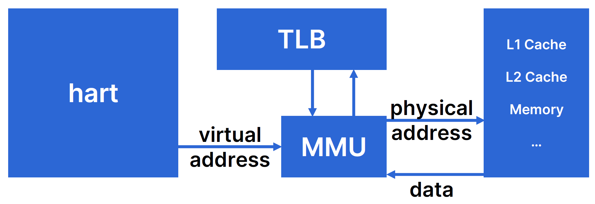

# 虚拟化硬件视图：内存管理

现代计算机系统的一个重要特征是对多个进程的支持。自然而然地，为了支持多个进程在CPU上并发地运行，从程序员的角度来看，程序员当然不希望某一个进程在运行途中，被另一个进程改写了自身的数据。所以，内存管理成为了必须所探讨的话题。现代计算机都拥有内存管理机制，历史上有一些体系结构支持段式内存管理，而现在大多数的体系结构都是不支持的，它们往往支持的是另一种管理方式——页式管理。

在这里，我们研究的是计算机系统上运行的一般程序。也就是说，如果我们还希望考察计算机系统上运行的0号进程——操作系统的话，我们讲述的内容就稍微有一些不同了。两者的不同之处我们会在之后做简单的提要。

### 内存管理的硬件基础

尽管一条指令的长度具有64位宽，但是，我们的存储器往往都没有这么大。也就是说，尽管理论上我们可以访问一个超级巨大的存储器（16EB，对比天河二号的总内存为1.4PB）中的全部内容，但是存储器的物理容量不会允许我们这么做。

这就要引入计算机系统的一个经典话题：虚拟化。对于计算机系统上运行的程序，我们如何做一定程度的抽象，使得从它的视角来看，自己好像独占了整个CPU、拥有内存地址？事实上前面的内容我们已经讨论到过前一个问题，即hart可以通过时钟中断强制引发进程的切换，如果两次切换的间隔是很小的，那么在一段时间上来看我们的两个进程就并发地在处理器上运行。对于后面一个问题，我们就要引入虚拟内存地址。

大多数处理器实际上使用的是页式内存管理机制。也就是说，将我们的物理内存按照一定的大小进行组织；简单而形象地说，我们将物理内存抽象成为一本书，那么物理内存就被划分为很多的连续片段，每个连续片段都叫页面。

在现代的计算机上，处理器核发出的访存指令的地址都是虚拟地址。它向内存管理单元（Memory Management Unit, MMU）发出虚拟地址，MMU会将真正的物理地址发往存储器。同样地，虚拟地址也对应着虚拟页面，它需要经过转换才能得到物理页面的地址。

基本的原理是，对于每一个地址，我们将其划分为两部分，用高位部分作为索引，到快表（Translation Lookaside Buffer, TLB）中寻找对应的物理页号，TLB中的数据就被称为页表项。由于物理页大小和虚拟页大小通常是一致的，因此只需要将得到的物理页号和虚拟页偏移量拼接，就能得到真实的物理地址。从偏移量这个角度也容易看到，一个页面的大小就是由偏移量的位数决定的：例如，若页面偏移量为12位，每一位对应一个字节，那么一个页面的大小就是4KB。

在某一片特定的内存区域里，存放着虚拟页号和物理页号的对应关系表。TLB实质上是对这一段内存区域的缓存，和Cache一样，只是只缓存虚拟页号和物理页号的对应关系。因此，和访问内存一样，通过虚拟页号的索引去查询物理页表时，实际上也是一次内存访问，访问的物理地址就是页表基址寄存器的值加上虚拟页号（虚拟页号作为偏移）。

### 缺页错误

我们知道，内存中的数据事实上是从磁盘中得来的。在这种意义下，内存实际上被看作了磁盘和CPU之间的缓存。好处就是，我们不必一次性将硬盘中的数据都搬到内存中（事实上也做不到），而是在程序运行的过程中，按照需要进行数据的搬运。

那么，就容易出现这样一种情况，程序所需要的数据还停留在磁盘中，这样当我们用虚拟地址在页目录项中找不到对应的物理页面时，就会触发缺页错误（page fault）。处理器接收到这一异常以后，处理器就会自动进入到异常处理流程，将对应的数据从磁盘上搬运到内存中。

### 多级页表

回到最开始的问题，假如我们希望每一个进程都拥有自己的地址空间，那么我们就需要为每一个进程都准备一个页表。假定页面大小仍为4KB，那么在64位寻址空间的条件下我们始终需要为每一个进程准备$2^{52}$个页表项，这是一个巨大的性能开支，我们当然不希望为了达到虚拟化的目的而穷尽我们的全部性能。因此，多级页表被引入进来。

其主要思想是，将虚拟地址进行多段划分，每一个低级页表项都指向下一级页表。这样，我们的一级页表就可以很小，并且我们不必一开始就为每一个一级页表项都分配一个二级页表项，只有我们需要使用到对应的虚拟地址的时候，我们再通过缺页错误异常处理来添加即可。由于TLB访问起来很快，因此多级页表通常情况下并不比一级页表慢多少。

### RISC-V中的页式内存管理

默认情况下，RISC-V处理器中的MMU是未启动的。和我们曾经实现过的RISC-V的五级流水线核一样，不论CPU处于哪一个特权级，访存的地址都会被认为是物理地址来直接访问物理内存。通过修改S特权级下的satp这个CSR，可以启动分页模式，此后S和U模式下CPU发出的地址都会被认为是虚拟地址。和我们刚才讨论的略有不同，在高地址处，RISC-V规定的是高层级页表，并且高层级页表是指向低层级页表的索引。

### 一次内存(磁盘)访问

现在我们从操作系统上运行的一个进程的视角，观察它的一次内存访问的过程是怎样的。

每一个进程都拥有自己的虚拟地址空间。例如，在64位机器上，进程会认为自己独占了整个$[0,2^{64}-1]$的内存空间。当进程需要访问内存时，CPU会将要访问的地址发给MMU。MMU在L1中匹配一级页地址，然后依次逐级找到物理页地址。

找到物理页地址后，再依照虚拟页偏移，得到物理地址。此时，MMU将物理地址提供给各级缓存，如果在缓存中命中，则直接将数据传递给CPU，否则则到更低的存储层次中寻找。

稍微有一些不同的是，页面命中完全是由硬件来完成的，而如果某一个页被标记为未缓存（意味着还没有提供一块内存空间缓存进程需要的数据），那么CPU会发生一个缺页异常。处理缺页必须要求硬件核操作系统共同完成。缺页异常的处理方法是从磁盘中读入对应所需要的内容，然后将其写入到内存的页面中。从这个意义上说，内存实际上是磁盘和CPU之间的一个缓存。