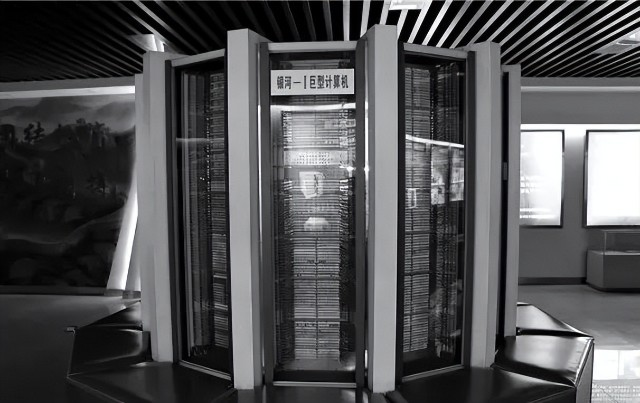
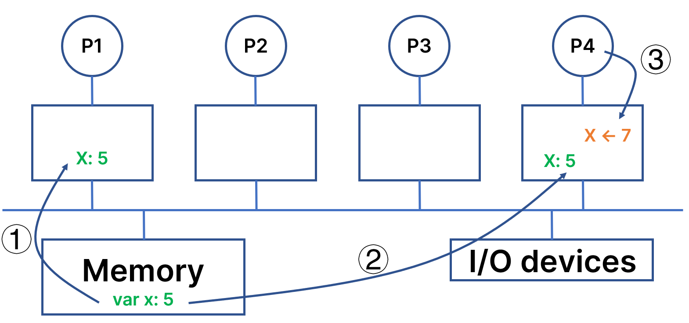
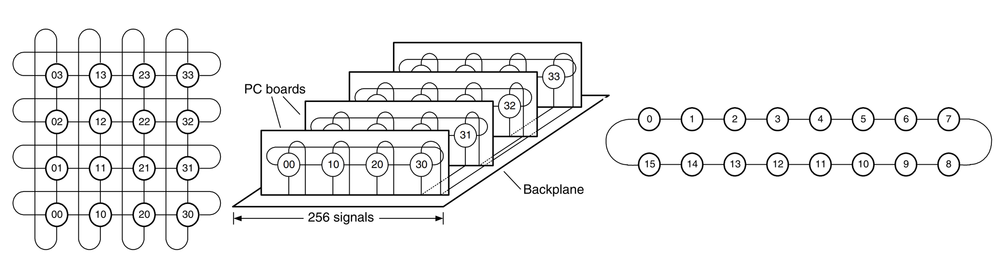

# 聚沙成塔的道路：并行计算机系统

!!! info "银河-Ⅰ亿次计算机"
    <figure markdown>
    { width="600" }
    <figcaption>银河-Ⅰ亿次计算机是中国第一台自主研制的亿次计算机系统，使中国跨入了世界研制巨型电子计算机国家的行列。</figcaption>
    </figure>

    银河-Ⅰ电子计算机系统由主机、海量存储器、维护诊断计算机、用户计算机、电源系统、各种外部设备及系统软件构成。它是当时中国运算速度最快、存储容量最大、功能最强的电子计算机系统，具有强大的数值计算能力和数据处理能力。它的向量运算速度为每秒一亿次以上，存储容量可达几百万字节，软件系统内容丰富，使用方便。它是石油和地质勘探、中长期天气数值预报、卫星图像处理、计算大型科研项目和国防建设的重要手段，对现代化建设具有重要的作用。

从历史趋势来看，多机计算机系统的架构主要是集群（Cluster）。从TOP500榜单来看，大部分世界上先进的超级计算机都使用了这一架构。究其原因，主要是集群计算机具有良好的可扩展性、灵活性，并且在大规模扩展时总体成本较低。

### 并行计算机系统的关键技术

#### 单机多核心高速缓存一致性

我们在性能评价部分曾经提到，高速缓存是性能的关键，它能够减少平均延迟、降低平均带宽需要。但是，在一个拥有多处理器的计算机系统中，不同处理器往往都独立拥有私有的缓存，当某个变量被多个处理器拷贝时，往往会分别出现在不同处理器的Cache中，而某一处理器对Cache的写操作可能对其他处理器是不可见的。在这种情况下，如何保证在某一时刻，所有处理器得到的变量的值符合程序员的预期？

单处理器中一致性维护具有两种策略：写穿透（Write Through）和写回（Write Back）。写穿透是指在第i级高速缓存中修改了某个字，那么在其下一级需要立即修改；写回是指对下一级的修改需要等到上一级发生改变的字被替换或消除时进行。

对于多处理器系统来说，由于多个处理器异步地相互操作，因此多个高速缓存中的同一高速缓存行的副本可能不同。成熟的编译器能够针对系统进行分析，使共享信息只存放在主存中，而不允许它们被放到高速缓存中；硬件能做的工作主要是总线侦听协议或基于目录协议。基于总线连接的系统中，每个处理器的高速缓存都被配置了一个侦听部件，能够侦听总线的事件：若侦听到主存中有一个单元被其它处理器所修改，而此单元在自己高速缓存中也有一个副本时，则该侦听部件就将自己高速缓存中的副本置为无效，或是把该高速缓存中的副本加以更新，以与主存中相应单元的内容保持一致。

#### 集群计算机上的编程模型

与单机运行的串行程序相比，集群计算机上编程的一个主要不同之处是不同的计算机之间需要分别创建进程，这些进程之间通过网络进行消息传递，来通力合作完成一项任务。

一般来说，将一个程序并行化的方式主要是

-   性能分析（Profiling）：找到程序中计算较为密集的部分
-   任务分割（Partition）：将大规模的计算分割为若干较小的独立部分
-   任务调度（Scheduling）：将上述划分后的任务分配给不同的进程或线程
-   资源映射（Mapping）：将进程或线程绑定到具体的物理核心上

在集群计算机上，内存是分布存在的，这意味着一台计算机的CPU不能直接访问另一台计算机中的内存。要想在不同的计算机之间进行信息交换，就必须显式地使用通信的手段。消息传递接口（Message Passing Interface, MPI）是一个用于并行计算的标准，依照这个标准，人们开发了不同的库，使得程序员在并行编程时只需要遵循同样的标准，就能正确实现点对点或广播通信。

对于异构的集群计算机，其编程难度会更大。一般来说，将CPU称为主机（Host），而将协处理器或加速卡称为设备（Device），在加速卡上运行的核函数通常是高度可并行的、程序计算密集的部分，通过加速卡上数量庞大的核心进行并行计算。将一个原本运行在CPU上的程序移植到加速卡上的工作量往往是很大的，确保一直前后程序在数学上的等价也是重要的挑战，但一旦成功移植到加速卡上，带来的收益是十分巨大的。

#### 互联系统

集群中不同的节点之间以什么样的方式联系起来是一个重大的挑战。一方面是来自硬件的限制。家庭网络中，以目前较为先进的CAT-6A网线为例，传输距离可达100m，传输速度可以达到10Gbit/s；在数据中心领域，infiniband已经能达到200Gbit/s的传输速度，并且延迟比以太网更低。然而，infiniband高昂的价格往往令人望而却步。另一方面是来自网络拓扑结构的限制。

几种不同的网络拓扑结构（William J Dally, Brian Towles，2003）

不同的拓扑结构能在很大程度上影响集群计算机的性能。如果两个需要大量通信的节点在拓扑结构上相距很远，往往意味着在实际中数据需要跨越非常多的交换机，这不仅会影响两个节点之间通信的性能，还会消耗大量的通信资源，影响集群中其他节点的通信。

#### 存储结构

### 超级计算机竞赛概述

一般而言，超级计算机竞赛要求由5~6名本科生构成的队伍，在某一功耗约束下，搭建自己的集群，然后在这个集群上进行应用的优化和测试。目前，由亚洲超算协会（Asia Supercomputer Community）发起的ASC Student Supercomputer Challenge是世界上参赛队伍最多、规模最大、赛题种类最为丰富的赛事之一；此外，每年由IEEE和ACM联合举办的全球超级计算大会（Supercomputing Conference, SC）上，也会有来自全球的本科生参加到会议的学生集群竞赛（Student Cluster Competition, SCC）环节中；每年在德国举办的国际超级计算大会（ISC High Performance）上，同样的活动也会进行。这三项赛事是国际公认的最高水平的面向本科生的超级计算比赛。

三项比赛的不同之处主要体现在时间安排上。一般而言，SCC要求参赛队伍在连续的48小时内完成集群搭建、基准测试、算例运行、论文复现、神秘应用优化等工作；ASC会提前为参赛选手提供数月的时间充分研究和优化某些应用，然后通过2天搭建集群，再使用2天时间完成基准测试、算例运行、团队赛、神秘应用，最后有答辩环节；ISC的比赛时间比较长，但总体上的环节与前面二者类似，但对参赛选手的代码能力要求较高。2023年，现场参赛的ISC比赛也被设定为了48小时。

下面我们介绍超级计算机竞赛的主要挑战。

#### 集群搭建

在3kW功耗的约束下，选择合适的硬件配置，以满足绝大多数题目的需要，并且在比赛的过程中保持系统的稳定性，是每一个集群的设计者必须考虑的最主要因素。例如，某些CPU的双精度浮点性能能够达到3Tflops，但是代价是250W的TDP，尽管能在科学计算应用中取得较大的优势，但是会降低留给GPU的功耗配额，在AI和基准测试题目中可能性能较差。

从硬件的装配来看，通常两个GPU会通过PCIe连接到两个CPU。当为了节约功耗而关闭其中一个CPU时，跨CPU的GPU P2P 通信就有可能走内存中转，会严重降低通信性能。此外，硬件的安装和CPU的限制可能还会带来出乎预期的结果，例如我们通常期望GPU工作在PCIe x16模式下，但往往安装完成后会发现GPU工作在PCIe x2模式下，这通常需要检查GPU与主板的连线。

以Inspur 5280M6服务器为例，原则上只能安装2块GPU。如果需要连接第3块GPU，需要对电源线做适当的改装。因此，大多数参赛队伍会在这个服务器的基础上选择三机六卡或四机八卡的架构。随着硬件技术的发展，GPU Chasiss使得一台服务器能够容纳下8张加速卡，极大地节省了服务器自身的功耗，但劣势在于只使用1台服务器，对于需要在CPU上大规模并行的科学计算应用来说十分不友好。

集群的搭建是一个系统工程，还需要考虑到操作系统、编译器、包管理工具、高性能库等各个层次的工具链和技术栈的选择。

操作系统方面，RHEL衍生版本被大量使用。选择这样的操作系统，主要是出于在工业上已经有大量成熟和典型的案例可供参考，并且RHEL作为面向服务器领域的广泛使用的操作系统(CentOS是其衍生版本之一)，该系统的稳定性是最受人们所欢迎的。

针对不同的应用，参赛者可能会使用不同的编译器。GCC(GNU Compiler Collection)是由GNU维护的、最为广泛使用的编译器，这是迄今为止被广泛认为是最完整支持C/C++各个不同标准的编译器；针对特定的微体系结构，一些商业厂商也推出了自己的编译器，例如Intel ICC针对Intel系列处理器有特定的优化，但是可能对C++特性的跟进情况比社区支持的GCC更差；在社区的推动下，一些新的、轻量级的编译器也在出现，例如Clang，它是LLVM的前端，一般来说，它在编译时使用的系统资源会更少。

值得注意的是，C语言存在许多未定义行为(Undefined Behavior, UB)，在程序员编写某些含有未定义行为的代码时，C语言标准允许编译器有任意实现。当程序出现这种行为时，其行为将是不可预测的，这可能会导致程序的崩溃、不正常的行为或安全漏洞。

未定义行为并不是违反计算机系统基于确定性原则运行的原则。在C语言标准中，只有被明确定义的行为才能保证其行为的可预测性和可重复性。而对于未定义行为，标准并没有规定其具体行为，因此其行为是不可预测的。C语言标准允许编译器对未定义行为进行任意实现，可以提高程序的执行效率、减少资源的消耗，而这对于计算机系统来说是非常重要的。程序员在编写代码时，要避免使用未定义行为，以确保程序的行为是可预测的和可重复的。

SC21上，上海科技大学代表队采用了极其现代和工业化的模式，使用Spack作为包管理工具，使用Ubuntu作为操作系统，加上完备的监控程序，在云端资源的管理和使用方面收获了很大的经验。

#### 功耗控制

将任意时刻的功耗控制在3kW以下是相当具有挑战的工作。一些成熟的参赛队得益于长期积累的良好功耗管理技术，在比赛现场能够做到功耗在2990W上下浮动。如果功耗控制能力较差，可能在某一时刻功耗突然波动，来到3kW之上，这时就必须停止当前任务并重新开始。

功耗控制往往可以引出更深入的话题，这关系到对整个计算机系统的把控，同时也有很多重要的细节（例如将不必要的I/O端口停止供电、拔出未使用的电源接口），在赛场上还会根据实际情况的不同做临时的调整。

#### 基准测试

基准测试是用于评估计算机系统性能的一种方法，它通过运行一系列标准化的测试程序来度量系统的各种性能指标，从而得出系统性能的量化指标。在全球超级计算机排名的TOP500榜单中，主要通过Linpack基准测试来评价超级计算机的性能，它主要测试计算机的浮点运算能力。

在ASC/SC/ISC的比赛中，一般来说基准测试也是Linpack(HPL)和HPCG。原则上基准测试的成绩主要由硬件决定，并且需要运行多次，以获得更可靠的结果。测试期间需要记录测试结果，如运行时间、吞吐量、延迟等。

#### 科学计算应用

如何在现代的处理器上运行上世纪的程序一直是令人头疼的问题。一方面，我们可能必须使用古老的编译器核操作系统，才能正确运行这些应用并且得到正确结果；另一方面，由于程序正确性的证明是非常困难的事情，我们很难保证经过算法优化之后的程序能不能永远与原程序的可观测行为保持完全一致；最后，在不同的平台上得到的结果可能是不同的。当前，某一些计算设备宣称自己能又快又好地进行低精度浮点运算，然而事实上其内部采用的是定点数实现，对于这样的黑盒子，如果硬件制造商不愿在手册中说明这些细节，我们很难去排查问题所在。

由于一些科学计算应用的编写者可能并不完全了解C语言标准，因此我们在选择不同的编译器时，需要多加考量，确保计算结果符合程序员的预期。一般而言，科学计算应用会指定编译器及其版本。例如，ASC18的神秘应用题目siesta，中山大学参赛队的运行策略是分兵两路，一组通过gcc编译，另一组通过icc编译，期望得到在intel处理器上的加速，结果是icc编译得到的版本无法正确链接库文件，gcc版本虽然能够成功编译，但是运行速度非常慢。

ASC22上，国防科大参赛队使用gcc、gfortran和g++来编译神秘应用题目FVCOM，无法正确运行；换作gcc、ifort和icpc来编译后，无法链接到正确的MPI库；换为题目推荐的icc、ifort和icpc后，虽然能够正确运行，但是得到的结果是错误的，会在某一时刻出现MPI Abort的问题。经赛后与中山大学讨论，发现中山大学队伍也出现了类似的问题，但是中山大学通过远程连接到天河二号上，发现在天河二号上能够正确编译，因此果断将intel编译器从2023年版本替换为和天河二号相同的2018年版本，并实现了FVCOM的正确编译和运行。

#### 人工智能应用

随着大模型疯狂席卷学术界和工业界，加上AI模糊计算的特性，人工智能应用对硬件的需求可以说是无底洞。为了应对人工智能应用对算力的庞大需求，专用领域加速器随着AI的爆炸也呈现出爆炸式的增大。关于专用领域加速器，我们将在下一个章节进行介绍。

此外，学界也提出了许多在有限计算资源下的训练方法，并且提供了多种并行和内存策略。在人工智能领域，尽管很多学者不愿意承认其价值，但是参数的调整已经成为了许多学术成果的重要来源。
