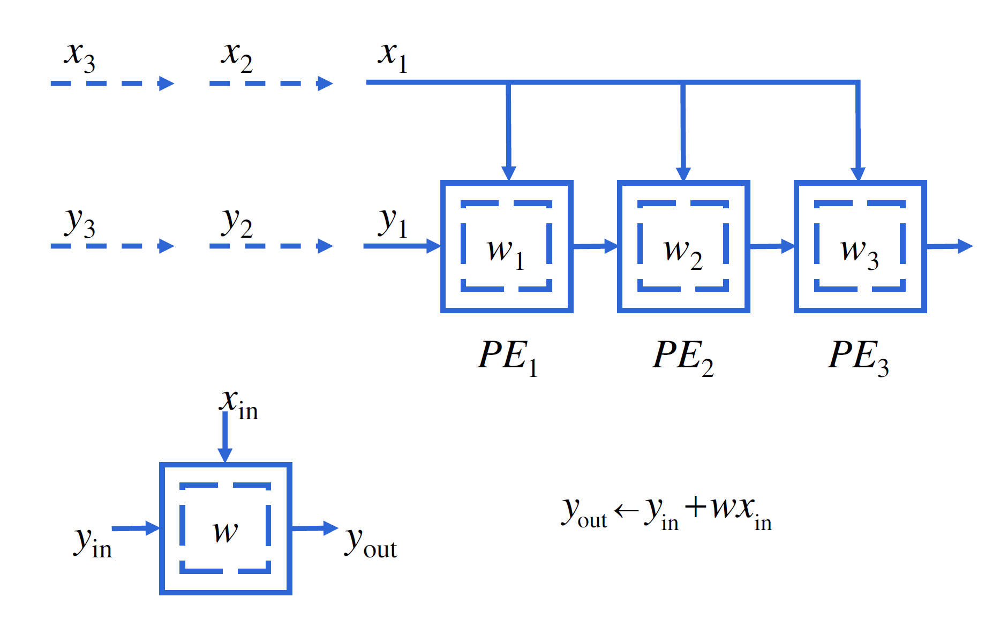

# 领域专用加速器：脉动阵列与流处理器

!!! info "Google TPU"
    <figure markdown>
    { width="600" }
    <figcaption>Google TPU是典型的专用领域加速器，为机器学习的训练和推理过程提供了良好的硬件支持</figcaption>
    </figure>

    与传统的中央处理器（CPU）和图形处理器（GPU）相比，TPU具有更高的能效和计算性能。它采用了定制的硬件架构，专门优化了矩阵运算和张量计算，这是深度学习中常见的计算操作。TPU的设计目标是提供高度并行的计算能力，以加速大规模的神经网络训练和推理任务。

1965年，Intel的联合创始人戈登·摩尔提出了一项著名的规律：集成电路上可容纳的晶体管数量，每隔18至24个月翻一番，而成本却相应降低一半。这就是著名的摩尔定律，它的提出主要基于半导体领域的发展趋势，即集成电路制造成本越来越低，同时处理速度和存储容量越来越大。摩尔定律并不只是关于晶体管数量的增长，更是关于微处理器和其他计算设备性能飞跃式提升的关键所在，从20世纪60年代的大型机器到80年代的个人电脑，再到如今的智能手机、平板电脑和云计算，摩尔定律的发展促进了现代计算机技术的突破。当然，戈登·摩尔也同时预测了这一趋势将在50年后停止。

过去的20年间，处理器的发展成功（也可能是被迫成功）地从单核转变到了多核。现如今，人们发现一些应用完全不需要用上CPU中的各个功能，并且CPU的通用性在这种操作类型单一的程序上已经捉襟见肘。过去的几十年中，乱序执行、多级存储器等思想在CPU的设计上起到了很好的指导作用，但对于某些应用，我们几乎能够准确地预知它的访存模式，并且像流媒体这样的应用是几乎没有数据重用的，因此多级存储器机制几乎没有作用，反而容易带来额外的开销。

对于领域专用加速器的设计者而言，借鉴Amdahl定律的思想，应该要找到某个重要到我们需要在SoC上（或专门设计一个外部设备）特地分出一部分区域来为某一类运算加速。在AI蓬勃发展的今天，矩阵乘已经成为了重要的运算，在Transformer中，矩阵乘是最耗时的计算操作之一。

在这一章中，我们的重点任务就是加速矩阵乘运算——使用脉动阵列（Systolic Array, SA）；其设计基于一种定向数据流的思想，即在具有大量处理单元的特定硬件中，数据沿着连续的通路流动，以获得高效率的并行计算。

### 脉动阵列

在前面的章节中我们介绍过，存储器是非常缓慢的。这意味着，从存储器中取出数据的时间，有时候竟然比计算数据本身耗费的时间还多！在传统的结构中，我们都是先从存储器中取出一个数，计算得到结果后再放回存储器；而在脉动阵列中，由于有了更多的运算单元，连续计算时不要求我们将中间值放回存储器，就能得到最后的计算结果。构建多级的存储层次当然是缓解这一问题的有效途径，但如果我们的数据量尤其巨大（例如庞大的矩阵乘法），这样的方案还是无法避免每一次取数据时可能发生的缓存不命中问题。

脉动阵列给出的答案是，让数据在计算中多“流动”一会儿。更本质地说。脉动阵列为一次性从存储器中取出多个数据参与运算提供了硬件支持。

{ width="200", align=left }

那么，什么样的计算能够适合于这样的硬件设计呢？

2012年前后，卷积神经网络（Convolutional Neural Network, CNN）引爆了学术界和工业界，紧接着，机器学习迎来了低谷之后的又一个高潮。CNN的基本思想是，通过卷积层、激活层、池化层和全连接层来建立起一个完整的神经网络。

卷积运算是适合于使用脉动阵列进行加速的。

对于一维的卷积，给定$\{ w_1, w_2, ..., w_k\}$和输入$\{x_1, x_2, ..., x_n\}$，要求计算得到$\{y_1, y_2, ..., y_{n+1-k}\}$，其中$y_i=w_1x_i+w_2x_{i+1}+...+w_kx_{i+k-1} \;(i+k-1\le n)$。

 

<figure markdown>
{ width="450" }
</figure>

如图片所示的那样，假定每个PE在1个周期内都能完成内部运算，那么提前读取$w_1, w_2, w_3$到PE中，第1周期结束时，计算出$y_3$，第2周期结束时，计算出$y_2$，第3周期结束时，计算出$y_1$。

<figure markdown>
{ width="450" }
</figure>

脉动阵列结构简单、规整，每个PE只与其相邻的PE有数据的流动，从而在硬件设计上，相邻PE之间的物理连线可以更短，这减小了PE之间的延迟，降低了布线难度，从而可以有较高的频率。采用朴素的方法解决计算问题，也是其设计者希望看到的。

### 通用矩阵乘法的脉动阵列实现

尽管脉动阵列是一项古老的技术，但直到2016年Google将脉动阵列实现并且应用到了数据中心中，脉动阵列才又一次成为人工智能领域的宠儿。2016年，第一代的Google TPU采用28nm工艺制造，主频700MHz，功耗40W，每秒钟能够进行92万亿次的8位整数乘加操作。现在，不仅在数据中心领域，一些超级计算机也使用脉动阵列加速矩阵运算。

假设我们有矩阵$A$和$B$，需要计算$C=AB$。我们假定$A$和$B$都是$3\times 3$的矩阵，那么，我们构造这样的2维脉动阵列。

<figure markdown>
{ width="450" }
</figure>

使用脉动阵列可以在7个周期内计算出两个$3\times 3$的矩阵相乘的结果。

### 脉动阵列与高性能计算

将脉动阵列应用到HPL基准测试上是一件非常吸引人的事情。这意味着我们能以更低的成本实现更高的性能，在绿色计算越来越受到关注的今天，这是一个具有很大潜力的话题。

但是，和大多数异构平台一样，将应用移植到脉动阵列上是存在一定难度的。并且，脉动阵列的规整与简单也限制了它的应用。好在人工智能大模型日益井喷式发展的今天，以Transformer为首的架构仍然主要是以矩阵乘作为其核心计算的，可以预见的是，脉动阵列在这类应用的加速上将起到很好的效果。
